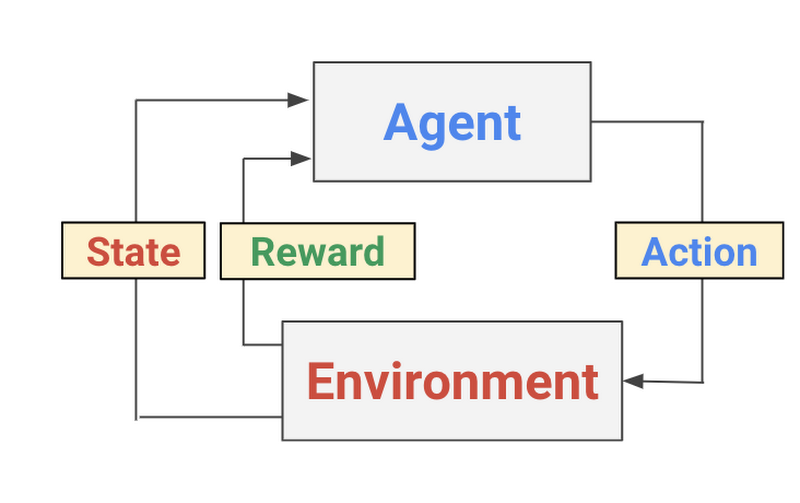

# Uproszczona symulacja parkowania przez samochód autonomiczny


## Dokumentacja biblioteki Ml-Agents
https://github.com/Unity-Technologies/ml-agents

## Cel projektu: 
Celem projektu było wyuczenie agenta przypominającego samochód osobowy w celu zaparkowania
w bardzo uproszczonych warunkach miejskich.

## Założenia:
Przed rozpoczęciem projektu ważnym etapem było ustalanie wymagań dotyczących środowiska w którym przeprowadzona została nauka.
Podczas tworzenia środowiska staraliśmy się w pełni wykorzystać umiejętności programistyczne w języku C# jak również podstawową
znajomość silnika graficzna Unity, który jest bardzo skomplikowanym narzędziem.

Pierwszym etapem było poznanie możliwości samego silnika oraz stowrzenie prostego modelu sterowania pojazdem, który jest
wykorzystywany przez agenta w trakcie nauki.

Kolejnym etapem było stworzenie samego środowiska przy użyciu darmowych assetów dostępnych w sklepie dostarczonym przez 
producenta silnika.

## Technologie:
- C#
- Unity
- Python
- Tensorflow
- PyTorch
- Mlagents

## Uruchomienie
Aby uruchomić środowisko należy pobrać to repozytorium, niezbędne będzie posiadanie
Unity w wersji: 2019.3.5f1
Po sklonowaniu repozytorium i uruchomieniu można projekt dowolnie edytować oraz uruchomić
poprzez wciśnięcie przycisku start u góry ekranu.

## Trening
Do wyuczenia modelu zostało wykorzystane **Uczenie przez wzmacianie** (ang. Reinforcement Learning).
W wirtualnym środowisku python konieczne jest zainstalowanie odpowiednich bibliotek aby możliwe było rozpoczęcie nauki.

Zgodnie z dokumentacją narzędzi konieczne jest ustalenie parametrów konfiguracji: 
```yaml
behaviors:
  CarBehavior:
    trainer_type: ppo
    hyperparameters:
      batch_size: 128
      buffer_size: 2048
      learning_rate: 0.0003
      beta: 0.01
      epsilon: 0.2
      lambd: 0.95
      num_epoch: 3
      learning_rate_schedule: linear
    network_settings:
      normalize: false
      hidden_units: 128
      num_layers: 2
    reward_signals:
      extrinsic:
        gamma: 0.99
        strength: 1.0
    max_steps: 1000000
    time_horizon: 64
    summary_freq: 5000
    threaded: true
```

## Czym jest Uczenie przez wzmacnianie? 

Jest to jeden z trzech głównych nurtów uczenia maszynowego, którego zadaniem jest interakcja ze środowiskiem za pomocą 
polityki na podstawie zebranych przez nią informacji.
W przeciwieństwie do innych metod w tym podejściu nie przygotowywujemy zestawu danych, tylko środowisko, z którego
nasz model będzie zbierał dane automatycznie.

Na poniższej grafice przedstawiony jest sposób działania


